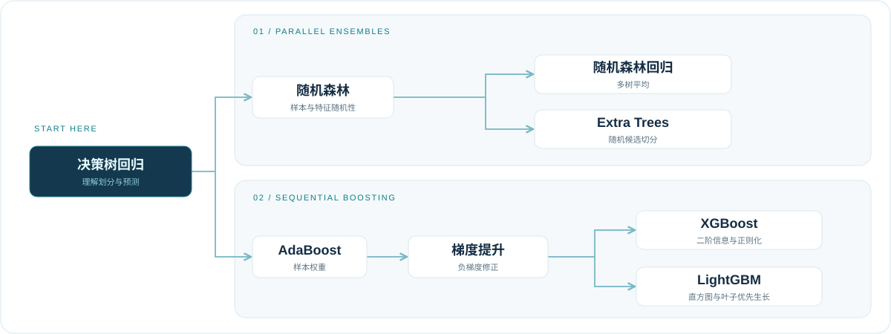

<h1 align="center">Daily Algorithm</h1>

<p align="center">
  <b>理解算法原理，记录学习过程，通过实验检验模型表现。</b><br>
  <sub>Python · scikit-learn · XGBoost · LightGBM · SHAP</sub>
</p>

<p align="center">
  <a href="#笔记导航">笔记导航</a> &nbsp;·&nbsp;
  <a href="#学习路线">学习路线</a> &nbsp;·&nbsp;
  <a href="#代码实践">代码实践</a> &nbsp;·&nbsp;
  <a href="#快速开始">快速开始</a>
</p>

<picture>
  <source media="(prefers-color-scheme: dark)" srcset="./assets/readme/overview-dark.svg">
  
</picture>

这里是我的算法学习仓库，整理算法思想、数学原理、训练流程、参数调优与模型优缺点。笔记聚焦树模型与集成学习，配套脚本用于数值表格数据的回归实验。

## 笔记导航

<table width="100%">
<tr>
<td width="30%" valign="top">

<h3>基础树模型</h3>
<p><sub>01 / FOUNDATIONS</sub></p>
<p>从一棵树开始，理解特征划分与叶子节点预测。</p>
<p><a href="./决策树回归.md"><b>决策树回归 →</b></a></p>
<p><sub>学习重点<br>划分标准 · 模型复杂度 · 过拟合</sub></p>
</td>
<td width="33%" valign="top">

<h3>并行集成</h3>
<p><sub>02 / ENSEMBLES</sub></p>
<p>让不同的树共同预测，认识随机性与模型方差。</p>
<p><a href="./随机森林.md">随机森林 →</a></p>
<p><a href="./随机森林回归.md">随机森林回归 →</a></p>
<p><a href="./Extra%20Trees.md">Extra Trees →</a></p>
</td>
<td width="37%" valign="top">

<h3>串行提升</h3>
<p><sub>03 / BOOSTING</sub></p>
<p>逐轮改进预测，理解样本权重与负梯度修正。</p>
<p><a href="./Adaboost.md">AdaBoost →</a></p>
<p><a href="./梯度提升.md">梯度提升 →</a></p>
<p><a href="./XGBoost.md">XGBoost →</a> &nbsp;·&nbsp; <a href="./LightGBM.md">LightGBM →</a></p>
</td>
</tr>
</table>

## 学习路线

从决策树回归出发，分别学习并行集成与串行提升。下图表示推荐阅读顺序。

<picture>
  <source media="(prefers-color-scheme: dark)" srcset="./assets/readme/roadmap-dark.svg">
  
</picture>

复习时，先回答三个问题：**每轮训练什么？树之间如何配合？预测怎样组合？** 再回到笔记查看公式与调参示例。

<details>
<summary><b>展开模型对照</b> · 7 类模型的核心差异</summary>

| 模型 | 训练方式 | 核心机制 | 复习重点 |
| :--- | :--- | :--- | :--- |
| 决策树 | 单棵树 | 递归划分特征空间，由叶子节点输出预测 | 划分标准、树深度与过拟合 |
| 随机森林 | 多棵树可独立训练 | 通过样本与特征随机性形成差异，再汇总预测 | Bootstrap、树间相关性与多树平均 |
| Extra Trees | 多棵树可独立训练 | 为候选特征随机生成切分点，再选择较优划分 | 与随机森林的区别、偏差与方差 |
| AdaBoost | 逐轮训练 | 调整样本权重，分类时对弱分类器加权投票 | 样本权重与分类器权重的区别 |
| 梯度提升 | 逐轮训练 | 新模型拟合当前损失的负梯度，累加修正结果 | 残差与负梯度、学习率与树的数量 |
| XGBoost | 逐轮提升 | 使用梯度、Hessian 和正则化优化树模型 | 叶子权重、分裂增益与复杂度控制 |
| LightGBM | 逐轮提升 | 使用直方图算法与叶子优先生长策略 | 桶、叶子数量与缺失值分支 |

</details>

## 代码实践

[`codes/`](./codes/) 提供 **6 个回归实验入口**，使用统一的数据格式和命令行参数，支持交叉验证调参、模型评估与 SHAP 分析。笔记中的代码片段用于理解关键步骤，完整实验从下方入口运行。

| 入口 | 模型 |
| :--- | :--- |
| [s01_linear.py](./codes/s01_linear.py) | 线性回归、ElasticNet |
| [s02_svr.py](./codes/s02_svr.py) | 支持向量回归（SVR） |
| [s03_knn.py](./codes/s03_knn.py) | K 近邻回归 |
| [s04_mlp.py](./codes/s04_mlp.py) | 多层感知机回归（MLP） |
| [s05_tree_models.py](./codes/s05_tree_models.py) | Random Forest、Extra Trees、GBDT、XGBoost、LightGBM、CatBoost、AdaBoost |
| [s06_rf.py](./codes/s06_rf.py) | 随机森林回归单独运行入口 |

<details>
<summary><b>实验流程与结果文件</b> · 数据划分、调参与输出说明</summary>

默认按样本随机划分 **70% 训练集与 30% 测试集**，在训练集内进行 **3 折交叉验证**和网格搜索。缺失值插补、常数特征筛除及适用模型的标准化在训练折内完成。

运行后默认保存到 `results/输入文件名/模型组/`，可通过 `--output` 指定输出目录。结果包括：

- 评估指标、最优参数与逐样本预测结果。
- 实际值与预测值散点图。
- SHAP 值、特征重要性与可视化图表。
- 训练集、测试集及交叉验证的划分记录。

分组划分、随机种子、输出文件和 SHAP 配置详见 [代码使用说明](./codes/README.md)。

</details>

## 快速开始

**阅读笔记**：直接点击上方[笔记导航](#笔记导航)，无需安装 Python 依赖。本地阅读可使用支持数学公式的 Markdown 编辑器。

**运行实验**：准备带表头的 CSV 或 Excel 文件，第一列为目标值 **Y**，其余列为数值特征 **X**。

<details>
<summary><b>展开安装与运行步骤</b> · 从数据检查到第一次训练</summary>

**1. 获取仓库并安装依赖**

```bash
git clone https://github.com/XYD-GIS/Daily-Algorithm.git
cd Daily-Algorithm
python -m pip install -r codes/requirements.txt
```

**2. 检查数据**

将下方示例路径替换为自己的数据文件绝对路径：

```bash
python codes/s06_rf.py --data "D:/data/input.csv" --check-only
```

这一步检查数据并执行训练集与测试集划分，不进行模型训练。

**3. 运行回归实验**

```bash
python codes/s06_rf.py --data "D:/data/input.csv"
```

上面以随机森林回归为例，替换脚本名称即可运行[代码实践](#代码实践)中对应的模型组。详细说明见 [codes/README.md](./codes/README.md)。

</details>

---

<p align="center">
  <b>理解一个算法，整理一份笔记，完成一次实践。</b><br>
  <sub>发现疏漏或有学习心得？欢迎通过 <a href="https://github.com/XYD-GIS/Daily-Algorithm/issues">Issues</a> 交流。</sub>
</p>
