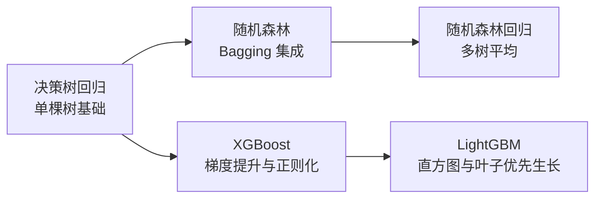

<div align="center">

# Daily Algorithm

### 算法学习笔记

从核心思想出发，梳理算法原理、训练流程、参数调优与适用场景。


[项目简介](#项目简介) · [学习路线](#学习路线) · [笔记目录](#笔记目录) · [模型对比](#模型对比) · [使用方式](#使用方式)

</div>

---

## 项目简介

这是我的算法学习仓库，用于记录新知识、整理关键概念，并沉淀可以随时复习的技术笔记。

当前内容集中在**机器学习树模型与集成学习**，从单棵决策树出发，逐步学习随机森林的 Bagging 思想，以及 XGBoost、LightGBM 的 Boosting 思想。笔记主要包含：

- 算法的核心思路与直观解释
- 训练和预测的主要流程
- 目标函数或关键机制
- 常用超参数与调优示例
- 模型优势、局限与使用注意事项

代码示例以 Python 为主，涉及 scikit-learn、XGBoost 与 LightGBM。

## 学习路线



推荐先掌握决策树如何完成特征划分，再分别沿两条路线学习：

1. **Bagging 路线**：决策树回归 → 随机森林 → 随机森林回归
2. **Boosting 路线**：决策树回归 → XGBoost → LightGBM

## 笔记目录

| 序号 | 笔记 | 类型 | 主要内容 |
| :---: | :--- | :--- | :--- |
| 01 | [决策树回归](./决策树回归.md) | 基础树模型 | 特征划分、递归分裂、叶子节点预测、网格搜索与模型评估 |
| 02 | [随机森林](./随机森林.md) | Bagging 集成 | Bootstrap 采样、随机特征选择、分类投票与回归平均 |
| 03 | [随机森林回归](./随机森林回归.md) | Bagging 回归 | 多棵回归树的集成、模型差异性、参数优化与优缺点 |
| 04 | [XGBoost](./XGBoost.md) | Boosting 集成 | 目标函数、二阶泰勒展开、正则化、分裂增益与数据泄漏防范 |
| 05 | [LightGBM](./LightGBM.md) | Boosting 集成 | 直方图算法、叶子优先生长、缺失值处理与参数优化 |

## 模型对比

| 模型 | 树之间的关系 | 结果生成方式 | 主要特点 |
| :--- | :--- | :--- | :--- |
| 决策树 | 单棵树 | 叶子节点输出预测 | 结构直观、易于解释，但容易过拟合 |
| 随机森林 | 多棵树可独立训练 | 分类投票或回归平均 | 通过样本和特征随机性降低方差 |
| XGBoost | 多棵树按顺序训练 | 累加每轮树的输出 | 使用梯度、Hessian 与正则化优化模型 |
| LightGBM | 多棵树按顺序训练 | 累加每轮树的输出 | 通过直方图算法和叶子优先生长提高效率 |

## 使用方式

可以直接点击[笔记目录](#笔记目录)中的链接在线阅读，也可以将仓库克隆到本地：

```bash
git clone https://github.com/XYD-GIS/Daily-Algorithm.git
cd Daily-Algorithm
```

使用支持 Markdown 的编辑器即可阅读。笔记中的代码以关键示例为主，运行前需根据具体任务补充依赖导入、数据准备以及训练集和测试集划分。

## 交流与反馈

如果发现内容疏漏，或希望交流算法学习心得，欢迎提交 [Issue](https://github.com/XYD-GIS/Daily-Algorithm/issues)。

---

<div align="center">

<sub>理解一个算法，整理一份笔记，积累一次进步。</sub>

</div>
